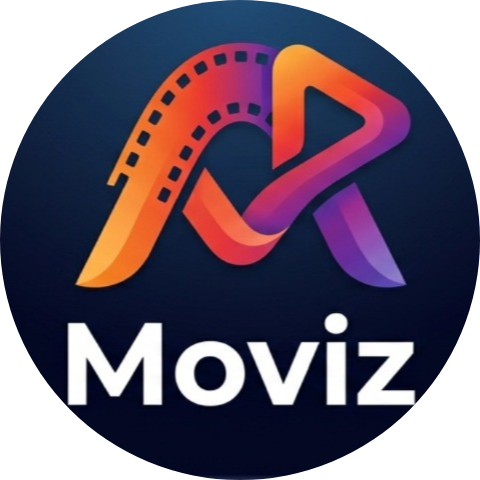
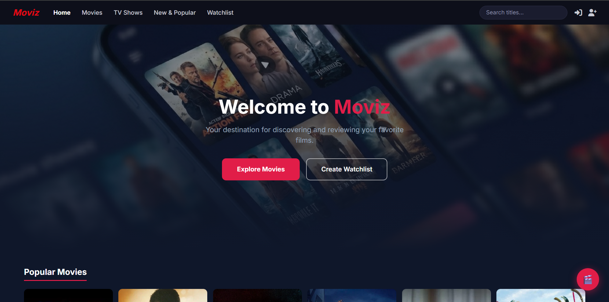
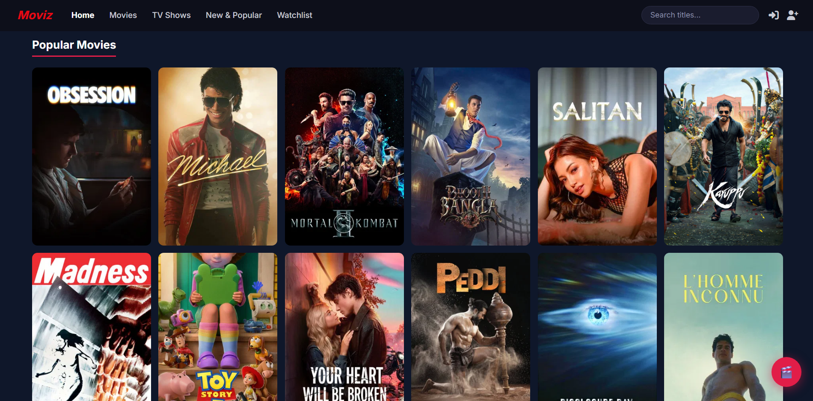
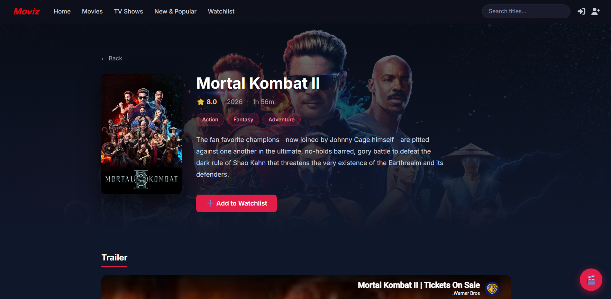
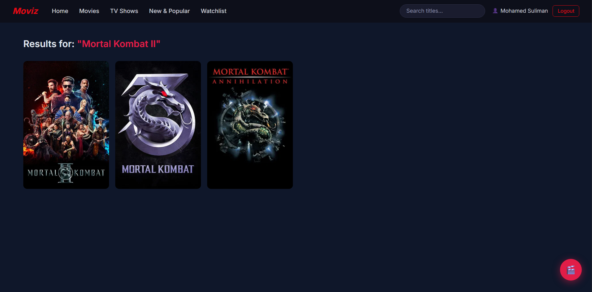
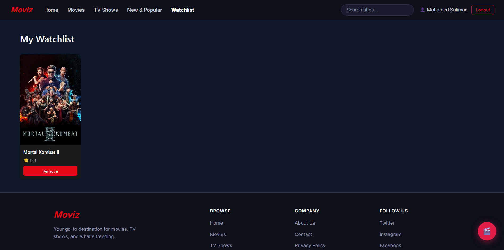
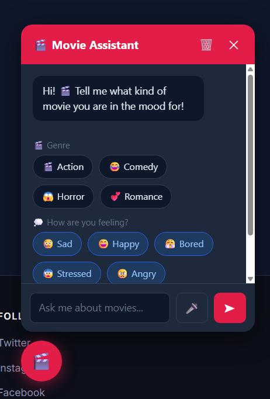
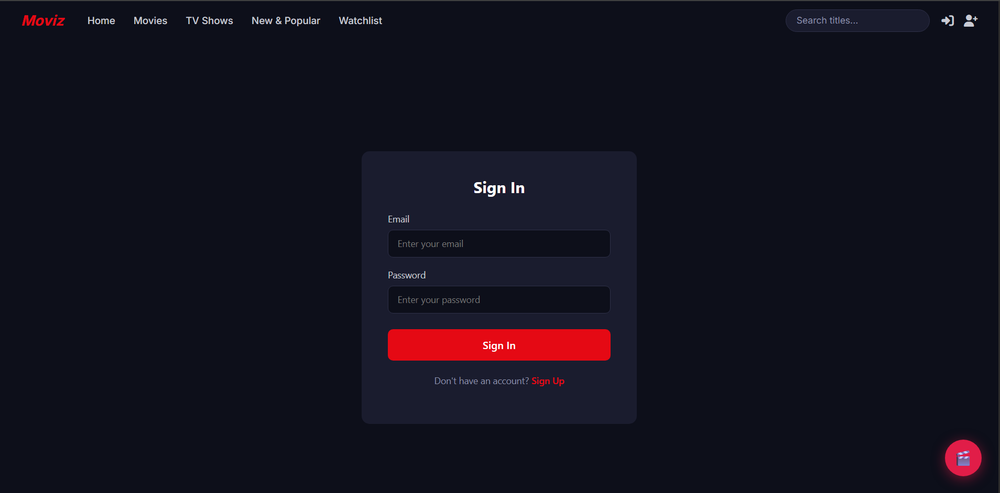
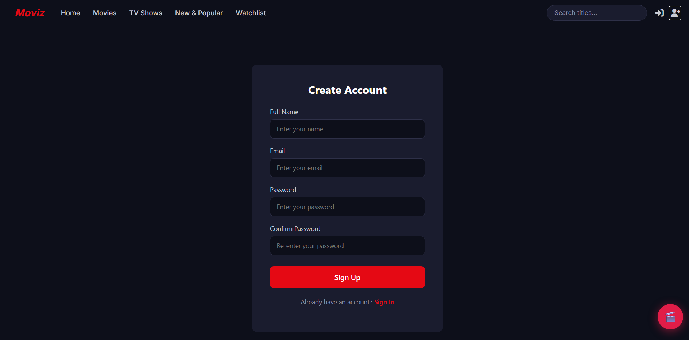

<div align="center">



# 🎬 Moviz

**Your destination for discovering movies, exploring genres, and getting AI-powered film recommendations.**


</div>

---

## 💡 Project Idea

**Moviz** is a modern web platform that allows users to browse, search, and discover movies and TV shows effortlessly. Through a sleek, Netflix-inspired dark interface, users can view full details of any title — including trailers directly from YouTube, complete cast information, ratings, genres, and runtime — all powered by the TMDB API. Each registered user gets a personal Watchlist to save their favourite titles, and an AI-powered chatbot that recommends content based on mood, genre, or any natural language request.

---

## ❗ Problem Statement

Today's audience faces a fragmented experience when trying to decide what to watch. They must jump between multiple platforms to find details, check ratings, watch trailers, and build a watch queue — all without any personalised guidance. There is no single, free, lightweight hub that unifies movie discovery, detailed information, personal list management, and AI-based recommendations in one seamless experience.

**Moviz solves this by being that single destination.**

---

## 🛠️ Technologies Used

| Category | Technology |
|---|---|
| **Frontend Framework** | React 19 |
| **Build Tool** | Vite 8 |
| **Routing** | React Router DOM v7 |
| **Styling** | Bootstrap 5 · CSS Modules |
| **HTTP Client** | Axios |
| **Slider / Carousel** | Swiper.js |
| **Forms & Validation** | Formik · Yup |
| **Notifications** | react-hot-toast |
| **Icons** | Font Awesome 7 |
| **Movie Data API** | TMDB (The Movie Database) |
| **AI Chatbot** | Groq SDK · LLaMA 3.3 70B |

---

## ✨ Key Features

### 🏠 Home Page
- Hero section with call-to-action links.
- Grid of popular movies fetched live from TMDB.
- Auto-scrolling genre carousel (Swiper.js) — click any genre to browse its movies.

### 🔍 Search
- Real-time movie search via the TMDB search endpoint.
- Results update automatically as the URL query changes.

### 🎥 Movies & 📺 TV Shows
- Dedicated pages for browsing movies and TV shows separately.
- Responsive grid layout that adapts from 2 to 5 columns.

### 🔥 New & Popular
- Weekly trending content (movies + TV shows combined) from TMDB.

### 🎭 Genre Filtering
- Browse movies filtered by any specific genre.

### 🎬 Movie Detail Page
- Full-screen backdrop hero image.
- Poster, rating, release year, runtime, genres, and overview.
- Embedded YouTube trailer.
- Cast section with actor photos and character names.
- Add / Remove from Watchlist button with toast feedback.

### 📋 Watchlist
- Protected route — only accessible after login.
- Saved to `localStorage` so it persists across sessions.
- Remove individual movies with one click.

### 🔐 Authentication
- Register and Login with Formik forms and Yup schema validation.
- User data stored in `localStorage`.
- Logged-in user's name shown in the navbar; Logout button available.

### 🤖 AI Movie Chatbot
- Floating chatbot powered by **LLaMA 3.3 70B** (via Groq API).
- Responds in the **same language** the user writes in (Arabic or English).
- Quick-select buttons for genres (Action, Comedy, Horror, Romance) and moods (Sad, Happy, Bored, Stressed, Angry, Romantic).
- **Voice input** support via the Web Speech API (Chrome).
- Chat history sent with each message for context-aware replies.
- Clear chat button to start fresh.

---

## 🖼️ Screenshots

| Home Page | Home Page (2) |
|---|---|
|  |  |

| Movie Details | Movie Details (2) |
|---|---|
|  |  |

| Movie Details (3) | Search Results |
|---|---|
|  |  |

| Watchlist | AI Chatbot |
|---|---|
|  |  |

| Login | Sign Up |
|---|---|
|  |  |

---

## 🚀 Getting Started

### Prerequisites

- Node.js ≥ 18
- A free [TMDB API key](https://www.themoviedb.org/settings/api)
- A free [Groq API key](https://console.groq.com/)

### Installation

```bash
# 1. Clone the repository
git clone https://github.com/your-username/moviz.git
cd moviz

# 2. Install dependencies
npm install

# 3. Create the environment variables file
```

Create a `.env` file in the project root:

```env
VITE_GROQ_KEY=your_groq_api_key_here
```

> The TMDB API key is currently hardcoded in the source files. For production, move it to `.env` as `VITE_TMDB_KEY`.

```bash
# 4. Start the development server
npm run dev
```

Open [http://localhost:5173](http://localhost:5173) in your browser.

### Build for Production

```bash
npm run build
npm run preview
```

---

## 📁 Project Structure

```
src/
├── App.jsx                    # Root component — router configuration
├── main.jsx                   # React entry point
├── App.css / index.css        # Global styles
│
├── context/
│   ├── UserContext.jsx        # Auth state (login / logout) via Context API
│   └── WatchlistContext.jsx   # Watchlist state persisted to localStorage
│
└── components/
    ├── Layout/                # Shared layout wrapper (Navbar + Chatbot + Outlet)
    ├── Navbar/                # Top navigation bar with search and auth controls
    ├── HomePage/              # Landing page — hero, popular movies, genre carousel
    ├── Movies/                # Movies listing page
    ├── TVShows/               # TV Shows listing page
    ├── Popular/               # New & Popular (weekly trending)
    ├── GenreMovies/           # Movies filtered by genre
    ├── Card/                  # Movie detail page (trailer, cast, watchlist toggle)
    ├── Search/                # Search results page
    ├── Watchlist/             # Protected watchlist page
    ├── Chatbot/               # AI movie assistant (Groq + voice input)
    ├── Login/                 # Login form (Formik + Yup)
    ├── Register/              # Register form (Formik + Yup)
    ├── ProtectedRoute/        # HOC — redirects unauthenticated users to /login
    ├── Footer/                # Page footer
    └── Notfound/              # 404 page
```

---

## ⚡ Challenges We Faced

### 01 — Integrating the AI Chatbot in the Browser
**Challenge:** Running the Groq SDK with LLaMA 3.3-70B directly from a browser environment is not officially supported — the library is designed for server-side Node.js usage.

**Solution:** Browser mode was enabled using `dangerouslyAllowBrowser: true` in the Groq SDK config, while the API key is stored securely inside `.env` environment variables.

---

### 02 — Voice Input Cross-Browser Compatibility
**Challenge:** The Web Speech API used for voice input in the chatbot is not supported across all browsers, causing the feature to silently fail for certain users.

**Solution:** A browser detection check was added before activating the microphone. If unsupported, an alert notification appears. The voice feature supports both Arabic and English.

---

### 03 — Protecting the Watchlist Route
**Challenge:** Unauthenticated users could manually type `/watchlist` in the URL bar and bypass the login requirement entirely.

**Solution:** A `ProtectedRoute` wrapper component reads the current user from React Context and redirects any unauthenticated visitor back to the Login page automatically.

---

### 04 — Persisting User Data After Page Refresh
**Challenge:** React state resets on every page refresh, causing the logged-in session and watchlist to disappear completely.

**Solution:** All user data and watchlist items are synchronised with `localStorage` via React Context on every change, then re-hydrated on app load — no backend needed.

---

## 🔮 Future Improvements

### 01 — Custom Backend (Node.js / Express)
Replace the TMDB API dependency with a dedicated backend for full control over data, caching, business logic, and security.

### 02 — Real Database (MongoDB / PostgreSQL)
Migrate from `localStorage` to a proper server-side database so user accounts and watchlists persist across all devices and sessions.

### 03 — Ratings & Reviews System
Allow authenticated users to rate movies on a 5-star scale and write personal reviews visible to the community.

### 04 — React Native Mobile App
Port the platform to iOS and Android using React Native for a native-feel mobile experience.
---

## 👥 Team Members

| # | Name |
|---|---|
| 1 | Mohamed Shabaan Suliman Elgishy |
| 2 | Mohanad Mohamed Fekry Mohamed |
| 3 | Alyaa Mosad Aly Ezz |
| 4 | Ahmed Hassan Ahmed Khalil |
| 5 | Nourhan Sameh Gamal Fayad |

---

## 🌐 Live Demo

[](https://moviz-theta.vercel.app/)

## 🎥 Demo Video

[](https://youtu.be/sEvB-GbGEK0)


---

<div align="center">
  Made with ❤️ by the Moviz Team
</div>

